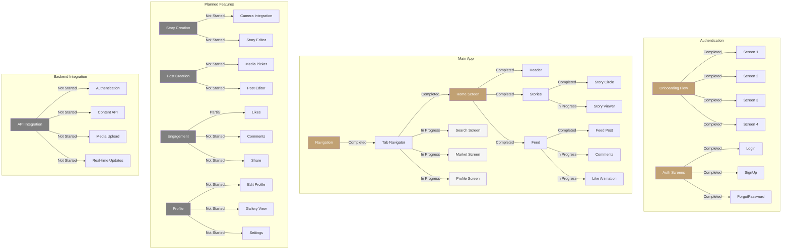

# NUUMI App Progress

```mermaid
graph TD
    subgraph Authentication
        A[Onboarding Flow] --> |Completed| A1[Screen 1]
        A --> |Completed| A2[Screen 2]
        A --> |Completed| A3[Screen 3]
        A --> |Completed| A4[Screen 4]
        B[Auth Screens] --> |Completed| B1[Login]
        B --> |Completed| B2[SignUp]
        B --> |Completed| B3[ForgotPassword]
    end

    subgraph Main App
        C[Navigation] --> |Completed| C1[Tab Navigator]
        C1 --> |Completed| D[Home Screen]
        C1 --> |In Progress| E[Search Screen]
        C1 --> |In Progress| F[Market Screen]
        C1 --> |In Progress| G[Profile Screen]

        D --> |Completed| D1[Header]
        D --> |Completed| D2[Stories]
        D --> |Completed| D3[Feed]

        D2 --> |Completed| D2a[Story Circle]
        D2 --> |In Progress| D2b[Story Viewer]
        
        D3 --> |Completed| D3a[Feed Post]
        D3 --> |In Progress| D3b[Comments]
        D3 --> |In Progress| D3c[Like Animation]
    end

    subgraph Features [Planned Features]
        H[Story Creation] --> |Not Started| H1[Camera Integration]
        H --> |Not Started| H2[Story Editor]
        
        I[Post Creation] --> |Not Started| I1[Media Picker]
        I --> |Not Started| I2[Post Editor]
        
        J[Engagement] --> |Partial| J1[Likes]
        J --> |Not Started| J2[Comments]
        J --> |Not Started| J3[Share]
        
        K[Profile] --> |Not Started| K1[Edit Profile]
        K --> |Not Started| K2[Gallery View]
        K --> |Not Started| K3[Settings]
    end

    subgraph Backend Integration
        L[API Integration] --> |Not Started| L1[Authentication]
        L --> |Not Started| L2[Content API]
        L --> |Not Started| L3[Media Upload]
        L --> |Not Started| L4[Real-time Updates]
    end

    style A fill:#c1a173,color:white
    style B fill:#c1a173,color:white
    style C fill:#c1a173,color:white
    style D fill:#c1a173,color:white
    
    style E fill:#f5f5f5
    style F fill:#f5f5f5
    style G fill:#f5f5f5
    
    style H fill:#808080,color:white
    style I fill:#808080,color:white
    style J fill:#808080,color:white
    style K fill:#808080,color:white
    style L fill:#808080,color:white
```

## Color Legend
- Gold/Bronze (#c1a173): Completed components
- Light Gray (#f5f5f5): In-progress components
- Medium Gray (#808080): Planned/Not started components
